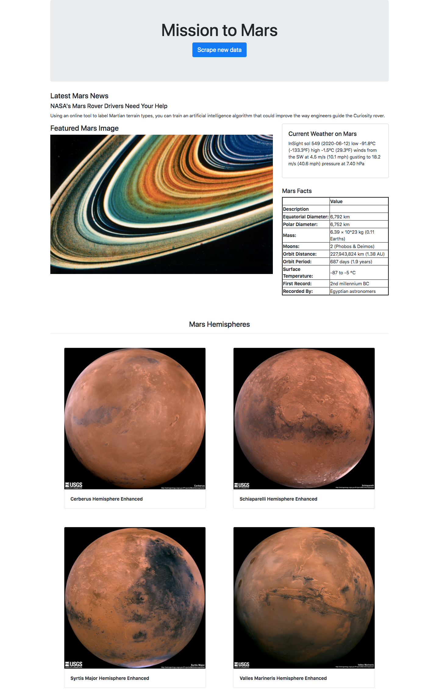

# Web Scraping Homework - Mission to Mars

A web application that scrapes various websites for data related to the Mission to Mars and displays the information in a single HTML page.

## Scraping

### Mars News
* Collect the news title and news description of the latest news

### JPL Mars Space Images - Featured Image
* Find the image url for the current Featured Mars Image

### Mars Weather
* Scrape the latest Mars weather tweet from the page

### Mars Facts
* Scrape the table containing facts about the planet including Diameter, Mass, etc.

### Mars Hemispheres
* Obtain urls of high resolution images for each of Mar's hemispheres

#### Output-file(s):  mission_to_mars.ipynb

## MongoDB and Flask Application

Use MongoDB with Flask templating to create a new HTML page that displays all of the information that was scraped from the URLs above.

#### Output-file(s): app.py, scrape_mars.py, nbconvert.ipnyb

